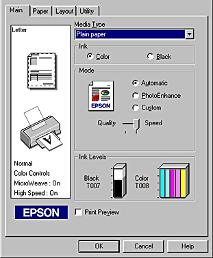
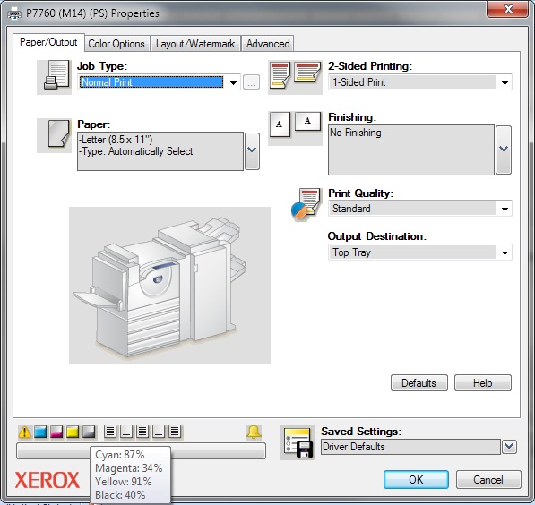
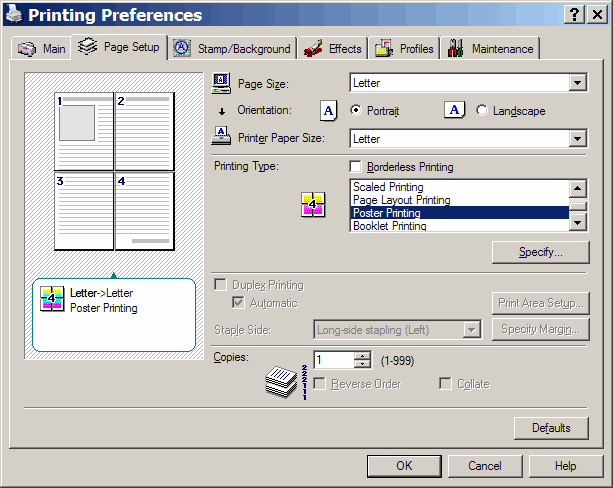
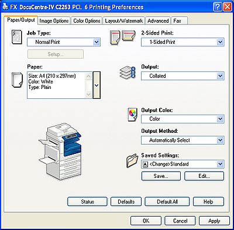

# Why make a programming language?

The answer to this question is very simple. A programming language is designed to solve a problem. Some languages are meant to solve lots of problems, and others are meant to solve a small set of problems in a particular **domain**. The latter are often called **domain style languages**.

An example of a domain style language is HTML, which was written to solve problems in the "describe the format of a web page" domain. Notice that a domain style language does not imply a weak language; HTML is one of the most written programming languages in the world. 

The first step to designing a programming language then is recognizing a problem, and defining the languages domain. 

Let's give that a whirl. 

## Recognizing a problem 
For a little under four years, I worked at a small print shop in the downtown district of my hometown. The job-title I made up for myself was "Print Specialist". I worked daily with any number of different printers, scanners, plotters, etc.

I loved that little shop, and I'm relatively sure I will always refer to it as the best job I ever had. Of course, it wasn't without it's annoyances; it was still a job. The biggest of which had to do with getting customer files to the machine they needed to get to. Each machine had it's own interface, and each interface was completely different than any other.

The terminology was different, the categories were different, everything was different.  To make matters worse, every interface seemed to update every month, and the upgraded version would be nothing like the original version. 

Just take a look at these four print drivers, each designed for the same set of purposes.

## Defining the domain

Once the problem has been recognized, the domain can be defined. 

Using the print driver problem, I defined my domain as the "describe print settings domain".

## Problems currently in domain

What problems exist in the "describe print setting domain"? Which problems will my language solve?

The primary goal of language is to provide a universal method by which to define print settings for a project. One single way to define print settings, that theoretically will work with any printer.  

